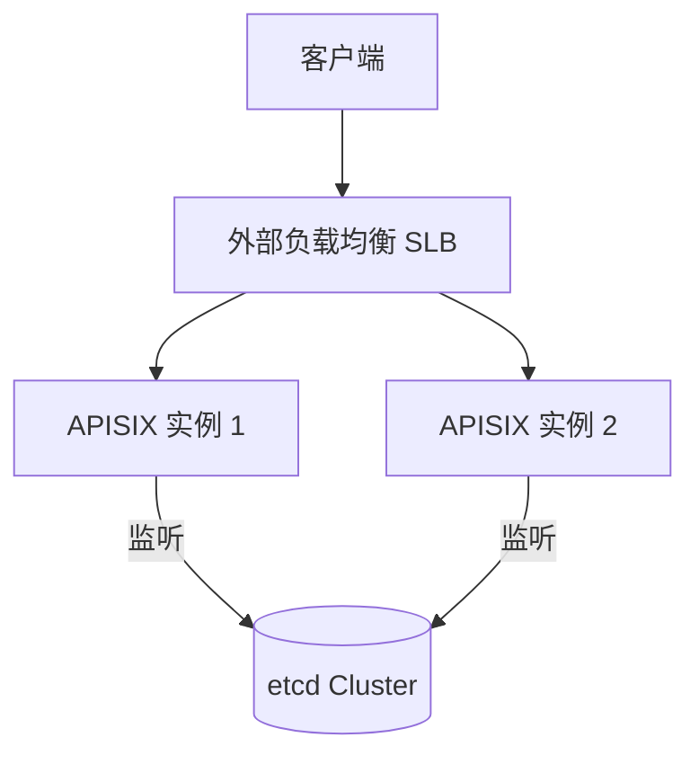

# 架构扩展与高可用路线图

本文档描述 uyou-api-gateway 从单机开发环境向支撑千万级并发的生产架构演进的路径。

## 1. APISIX 负载均衡演进

### 当前 (开发/测试)
APISIX 作为单点运行，配置存储在本地或单点 etcd。

### 生产架构 (Scale-out)
1.  **控制面与数据面分离**：
    *   部署一个高可用的 **etcd 集团 (3或5节点)**。
    *   部署多个 **APISIX 实例 (无状态)**，它们同时连接到 etcd 集群。
2.  **外部负载均衡 (LB)**：
    *   在多个 APISIX 前端部署云服务商的 **SLB (Server Load Balancer)** 或自建 **Nginx+Keepalived**。
    *   SLB 使用监听路由机制（Round Robin）分发流量。

## 2. 微服务与数据分片

### 服务治理策略
*   **无状态化**：所有微服务实例 (User, Post 等) 保持完全无状态。
*   **服务发现**：进入 K8s 环境后，APISIX 弃用固定 IP，直接通过 K8s Service Name (DNS) 访问上游。

### 数据库拆分路线
1.  **第一阶段 (逻辑隔离)**：单台物理数据库服务器，使用不同的 Schema 隔离业务库（如 `user_db`, `post_db`）。
2.  **第二阶段 (物理隔离)**：每个微服务使用独立的数据库集群（如 RDS/自建集群）。
3.  **第三阶段 (水平切分/Sharding)**：
    *   当单库无法支撑时，引入物理切分。
    *   **ID 分片策略**：通常通过用户 ID 取模。
    *   **中间件**：使用 ShardingSphere 或 Vitess 处理分片逻辑。
    *   **注意**：APISIX 不感知分片。APISIX 将请求发给微服务实例，微服务实例内部根据 ID 向数据库中间件请求数据。

## 3. 运维管理 (K8s 转型)

当容器数量达到 20+ 以上时，必须从 `docker-compose` 转向 **Kubernetes**。

*   **统一管理**：整个 API Gateway 及其微服务运行在一个 **单一的 K8s 集群** 内。
*   **隔离策略**：
    *   使用 `Namespace` 隔离 `prod` (生产), `staging` (预发), `dev` (开发)。
    *   使用 `Resource Quotas` 限制每个服务的最大 CPU/内存。
*   **GitOps 流程**：
    1.  代码合并到 Git。
    2.  CI 构建镜像。
    3.  使用 **ArgoCD** 将 Git 中的路由 YAML 和 K8s 部署文件同步到集群。

## 4. 跨服务数据一致性 (分布式挑战)

在完全拆分的架构中，解决“用户关系”或“跨服务联表”的方案：

1.  **API Composition (聚合模式)**：适合简单查询。网关或 BFF 调用 A 和 B 服务，回传结果。
2.  **Eventual Consistency (事件驱动)**：
    *   使用 Kafka/RabbitMQ。
    *   服务 A 变更 -> 发送事件 -> 服务 B 订阅事件并更新本地缓存/副本。
3.  **BFF 层 (Backend For Frontend)**：为特定的前端页面定制一个微服务，专门负责从不同微服务中“采集并清洗”数据。

---

*最新更新：2026-01-27*
