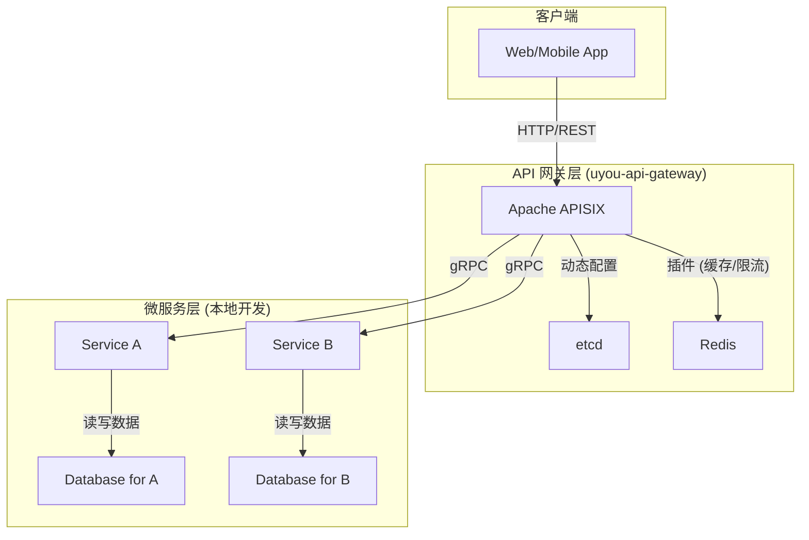

# 架构设计

本文档阐述 uyou-api-gateway 框架的核心架构设计、技术选型和设计原则。

## 目录

1. [设计哲学](#1-设计哲学)
2. [整体架构图](#2-整体架构图)
3. [核心组件](#3-核心组件)
4. [请求生命周期](#4-请求生命周期)
5. [服务生成器架构](#5-服务生成器架构)

---

## 1. 设计哲学

uyou-api-gateway 框架遵循以下设计哲学:

- **关注点分离 (SoC)**: 框架负责基础设施, 开发者负责业务逻辑。API 网关处理所有横切关注点 (如认证、限流、路由), 微服务只处理业务。
- **约定优于配置 (CoC)**: 通过提供标准化的项目结构和生成器, 减少开发者需要做出的决策, 提高开发效率。
- **开发者体验优先**: 提供一键式的本地开发环境、清晰的文档和简化的命令, 降低微服务开发的门槛。
- **生产就绪**: 框架本身是为生产环境设计的, 提供高可用、可扩展的基础设施。

## 2. 整体架构图

**架构说明**:

- **客户端**: 通过标准的 HTTP/REST API 与系统交互。
- **API 网关层**: 是整个系统的入口。`Apache APISIX` 负责接收所有请求, 并执行路由、认证、协议转换等操作。`etcd` 作为配置中心, 存储所有动态路由规则。`Redis` 提供缓存和限流支持。
- **微服务层**: 包含多个独立的业务服务 (Service A, Service B)。每个服务都有自己的数据库, 实现了数据的隔离。在本地开发时, 每个服务及其依赖都由其专属的 `docker-compose.yml` 管理。

## 3. 核心组件

### Apache APISIX (API 网关)

- **角色**: 系统的统一入口, 流量的“守门员”。
- **核心功能**:
    - **动态路由**: 基于 `etcd` 实现毫秒级的路由更新, 无需重启。
    - **协议转换**: 内置 `grpc-transcode` 插件, 自动将客户端的 HTTP/JSON 请求转换为后端的 gRPC 请求。
    - **插件生态**: 提供认证 (`jwt-auth`)、限流 (`rate-limiting`)、监控 (`prometheus`) 等丰富的插件。
    - **高性能**: 基于 Nginx 和 LuaJIT, 提供极高的请求处理能力。

### etcd (配置中心)

- **角色**: APISIX 的“大脑”, 存储所有动态数据。
- **核心功能**:
    - **存储路由规则**: APISIX 从 `etcd` 读取路由、上游、插件等配置。
    - **配置监听**: APISIX 通过 `watch` 机制实时感知配置变化并应用。
    - **高可用**: `etcd` 是一个分布式键值存储, 通常以集群模式部署以保证高可用。

### Go (微服务开发语言)

- **角色**: 业务逻辑的实现语言。
- **选择理由**:
    - **并发性能**: Go 的 Goroutine 和 Channel 非常适合高并发的微服务场景。
    - **静态编译**: 编译为单一二进制文件, 易于部署。
    - **强大的生态**: 拥有成熟的 gRPC、数据库驱动和 Web 框架。

### gRPC (RPC 框架)

- **角色**: 微服务之间以及网关与微服务之间的通信协议。
- **选择理由**:
    - **高性能**: 基于 HTTP/2 和 Protobuf, 序列化/反序列化速度快, 网络传输效率高。
    - **强类型**: 通过 `.proto` 文件定义服务接口, 提供编译时类型检查, 减少运行时错误。
    - **跨语言**: 支持多种主流编程语言。

## 4. 请求生命周期

一个典型的 HTTP 请求在框架中的处理流程如下:

1. **客户端** 发起 `POST /api/v1/users` 请求。
2. **APISIX** 接收请求, 根据 `uri` 匹配到预先配置的路由规则。
3. **APISIX** 执行插件:
    - `jwt-auth` 插件 (如果配置) 验证 Token。
    - `rate-limiting` 插件 (如果配置) 检查请求频率。
4. **APISIX** 的 `grpc-transcode` 插件执行协议转换:
    - 将 HTTP Body (JSON) 转换为 Protobuf 消息。
    - 将请求方法 `POST` 映射到 gRPC 的 `Create` 方法。
5. **APISIX** 将 gRPC 请求转发到上游 (Upstream), 即 `user-service` 的 gRPC 端口。
6. **user-service** 处理 gRPC 请求, 执行业务逻辑, 与数据库交互, 并返回 Protobuf 响应。
7. **APISIX** 接收到 gRPC 响应, `grpc-transcode` 插件再次工作, 将 Protobuf 响应转换为 JSON。
8. **APISIX** 将 HTTP 200 OK 和 JSON Body 返回给客户端。

## 5. 服务生成器架构

`make new-service` 是框架提升开发效率的关键。其背后的 `scaffold/generator.go` 遵循模板驱动的设计。

- **输入**: 通过命令行交互收集服务名称、数据库类型等核心参数。
- **处理**: 使用 Go 的 `text/template` 引擎, 将收集到的参数填充到预定义的模板文件中。
- **输出**: 生成一个完整的、可独立运行的微服务项目, 包括:
    - `go.mod`
    - `Makefile`
    - `Dockerfile`
    - `docker-compose.yml` (根据数据库选择动态生成)
    - `*.proto` API 模板
    - Go 代码结构模板

这种方式保证了所有微服务都遵循统一的、最佳实践的结构, 极大地降低了新项目的启动成本。
